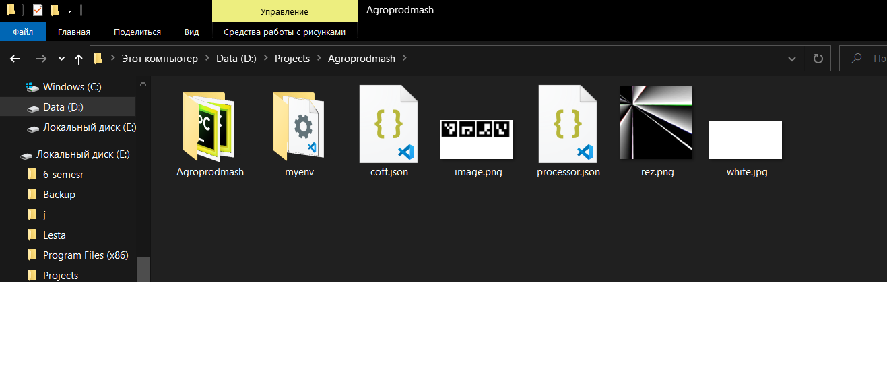

# Agroprodmash

Если есть траблы - звони/пиши. Готов к удаленному управлению, если это будет необходимо

## Последовательность действий

- [Скачать себе репозиторий](#Скачатьсеберепозиторий)
- [Установить библиотеки из него в виртуальное пространство](#Установитьбиблиотекиизнеговвиртуальноепространство)
- [Подсосаться к роботу](#Подсосатьсякроботу)
- [Калибровка света и яркости(ползунки)](#Калибровкасветаияркости)
- [Калибровка цвета и логотипа робовизард(ползунки)](#Калибровкацветаилоготипаробовизард)
- [Калибровка Хафа(ползунки)](#КалибровкаХафа)
- [Калибровка координат Питон](#КалибровкакоординатПитон)
- [Калибровка координат AS](#КалибровкакоординатAS)
- [Калибровка предсказания](#Калибровкапредсказания)
- [amcap.exe](#amcap.exe)
- [Траблшутинг](#Калибровкапредсказания)
- [Источники](#Источники)

## Скачать себе репозиторий

Скачиваешь или клонируешь репозиторий

(кнопка Code -> download ZIP)

Папка должна выглядить так:



## Установить библиотеки из него в виртуальное пространство

Установи все библиотеки из myenv - если не знаешь как, спроси у chatgpt - он понятнее и подробнее объяснит

## Траблшутинг

Какие инструменты тестирования использованы в проекте и как их запускать. Например:

Наш проект покрыт юнит-тестами Jest. Для их запуска выполните команду:

```sh
npm run test
```

## Источники

ChatGPT

```sh
$ npm i your-awesome-plugin-name
```

```typescript
import { hi } from "your-awesome-plugin-name";

hi(); // Выведет в консоль "Привет!"
```
